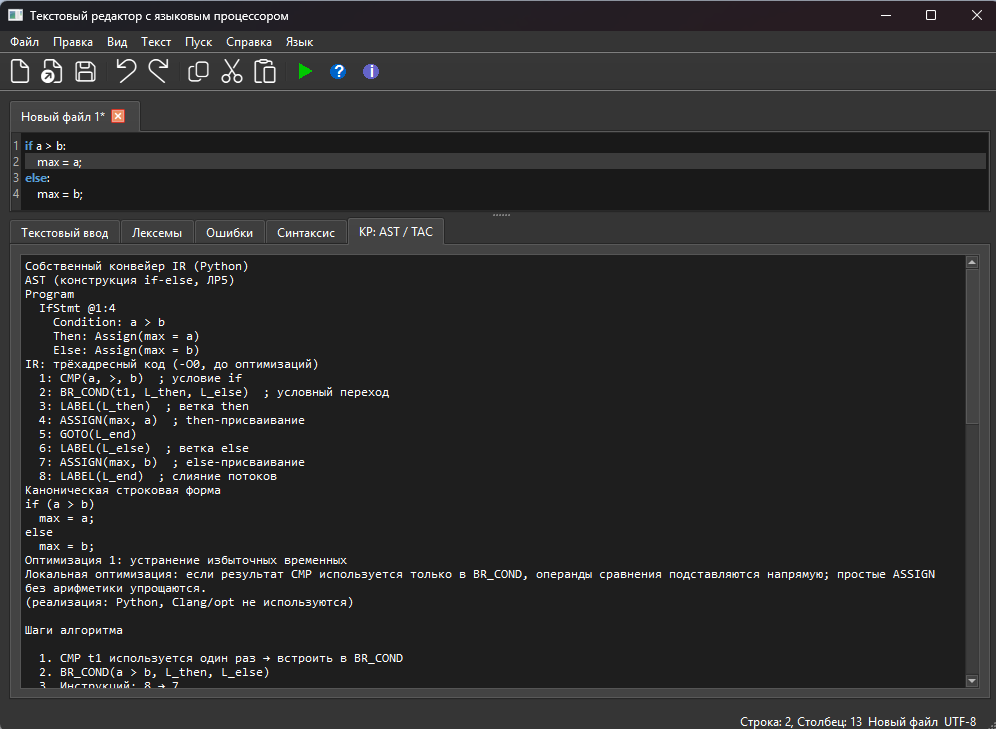
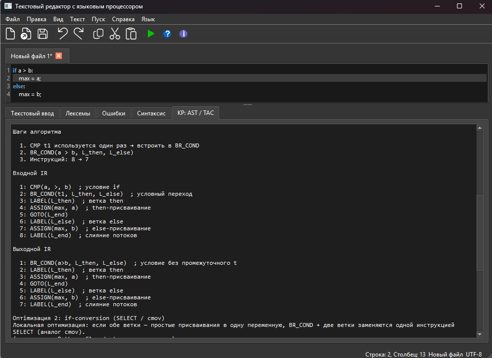
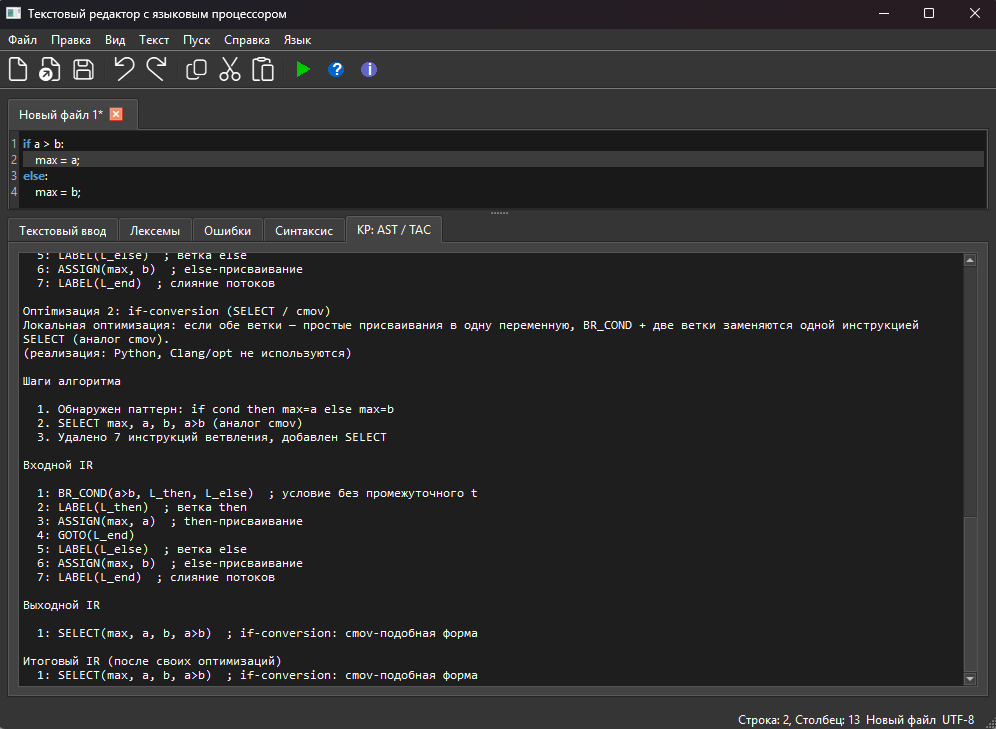

# Лабораторная работа 7. Анализ и преобразование кода (собственный IR и оптимизации)


## Цель работы

Познакомиться с построением AST и промежуточного представления (TAC), применить локальные оптимизации, проанализировать условные переходы в C и интегрировать все этапы в GUI языкового процессора (продолжение ЛР 1–5).

## Постановка задачи

**Общее задание:**

- Построить AST для программы на C/C++.  
- Сгенерировать промежуточное представление (TAC).  
- Применить оптимизации IR.  
- Проанализировать результат.  

## Ubuntu


user@user-Z390-D:~/Рабочий стол/7$ diff main_O0.ll main_O2.ll
6,30c6,10
< ; Function Attrs: noinline nounwind optnone uwtable
< define dso_local i32 @max(i32 noundef %0, i32 noundef %1) #0 {
<   %3 = alloca i32, align 4
<   %4 = alloca i32, align 4
<   %5 = alloca i32, align 4
<   store i32 %0, i32* %4, align 4
<   store i32 %1, i32* %5, align 4
<   %6 = load i32, i32* %4, align 4
<   %7 = load i32, i32* %5, align 4
<   %8 = icmp sgt i32 %6, %7
<   br i1 %8, label %9, label %11
<
< 9:                                                ; preds = %2
<   %10 = load i32, i32* %4, align 4
<   store i32 %10, i32* %3, align 4
<   br label %13
<
< 11:                                               ; preds = %2
<   %12 = load i32, i32* %5, align 4
<   store i32 %12, i32* %3, align 4
<   br label %13
<
< 13:                                               ; preds = %11, %9
<   %14 = load i32, i32* %3, align 4
<   ret i32 %14
---
> ; Function Attrs: mustprogress nofree norecurse nosync nounwind readnone uwtable willreturn
> define dso_local i32 @max(i32 noundef %0, i32 noundef %1) local_unnamed_addr #0 {
>   %3 = icmp sgt i32 %0, %1
>   %4 = select i1 %3, i32 %0, i32 %1
>   ret i32 %4
33c13
< attributes #0 = { noinline nounwind optnone uwtable "frame-pointer"="all" "min-legal-vector-width"="0" "no-trapping-math"="true" "stack-protector-buffer-size"="8" "target-cpu"="x86-64" "target-features"="+cx8,+fxsr,+mmx,+sse,+sse2,+x87" "tune-cpu"="generic" }
---
> attributes #0 = { mustprogress nofree norecurse nosync nounwind readnone uwtable willreturn "frame-pointer"="none" "min-legal-vector-width"="0" "no-trapping-math"="true" "stack-protector-buffer-size"="8" "target-cpu"="x86-64" "target-features"="+cx8,+fxsr,+mmx,+sse,+sse2,+x87" "tune-cpu"="generic" }
35,36c15,16
< !llvm.module.flags = !{!0, !1, !2, !3, !4}
< !llvm.ident = !{!5}
---
> !llvm.module.flags = !{!0, !1, !2, !3}
> !llvm.ident = !{!4}
42,43c22
< !4 = !{i32 7, !"frame-pointer", i32 2}
< !5 = !{!"Ubuntu clang version 14.0.0-1ubuntu1.1"}
---
> !4 = !{!"Ubuntu clang version 14.0.0-1ubuntu1.1"}


## Ответы на вопросы
Примените -O2. Изменилось ли условие на cmov?
IR для -O2:
llvm
define i32 @max(i32 %a, i32 %b) {
entry:
  %cmp = icmp sgt i32 %a, %b
  %spec.select = select i1 %cmp, i32 %a, i32 %b
  ret i32 %spec.select
}
Вывод: Да, условие изменилось.
Вместо условного перехода (br) используется инструкция select.
На уровне машинного кода select обычно транслируется в условное перемещение (cmov на x86), если целевая архитектура его поддерживает.
Это позволяет избежать сброса конвейера при неправильном предсказании ветвления.
Исследуйте, меняется ли CFG при использовании -branch-prob
Команда:
bash
opt -branch-prob -dot-cfg -disable-output main.ll
Что происходит:
Сама структура CFG не меняется (количество блоков, рёбра те же).
Добавляются метаданные вероятностей (!prof) к рёбрам переходов.
Например, для br i1 %cmp, label %if.then, label %if.else добавляется !prof !{!"branch_weights", i32 500, i32 500} (50%/50%).
Эти метаданные используются последующими оптимизациями (например, для упорядочивания блоков при генерации кода, чтобы часто исполняемая ветка шла без перехода).
Вывод: CFG как граф не меняется, но его аннотации (веса рёбер) изменяются, что влияет на компоновку базовых блоков в машинном коде.

Сделайте вывод о том, как LLVM оптимизирует условные переходы
Выводы:
На низком уровне оптимизации (-O0)
LLVM сохраняет структуру if-else как условный ветвительный переход (br). Это удобно для отладки, но неэффективно при выполнении.
На высоком уровне оптимизации (-O2 и выше)
LLVM преобразует простые условные операторы, не имеющие побочных эффектов, в инструкцию select (условное перемещение). Преимущества:
Отсутствие потенциально непредсказуемого ветвления.
Лучшая производительность на конвейерных процессорах.
Компактный код.
Когда select не применяется:
Если в ветках есть вызовы функций.
Если есть операции ввода-вывода или другие побочные эффекты.
Если типы данных не поддерживают условное перемещение (например, большие структуры).

Дополнительные оптимизации:
Параметр -branch-prob не меняет граф, но добавляет профилировочную информацию для принятия решений о перестановке блоков (блок с большей вероятностью размещается без перехода).
Совместно с -O2 может также применяться разворот циклов, инлайнинг и другие оптимизации, которые могут полностью удалить условие, если оно становится константным.
Сравнение с тернарным оператором
IR для тернарного оператора после -O2 идентичен IR для if-else после оптимизации. Оба превращаются в select. Значит, с точки зрения конечного машинного кода эти конструкции эквивалентны.
Итог: LLVM агрессивно заменяет условные переходы на условные перемещения везде, где это возможно, что является одной из ключевых оптимизаций для повышения производительности современных процессоров.


**Дополнительное задание (бонус, до 5 баллов):**

- Построить AST и IR для конструкции из ЛР5/КР (`if-else` Python).  
- Реализовать **две** локальные оптимизации на собственном IR.  
- Продемонстрировать входной и выходной IR для каждой оптимизации в GUI.  

**Индивидуальный вариант — условные переходы:**

```c
int max(int a, int b) {
    if (a > b)
        return a;
    else
        return b;
}
```

| № | Задание | Содержание |
|---|---------|------------|
| 1 | AST и IR (-O0) | Построить AST и IR для `max` |
| 2 | -O2 / cmov | Применить -O2; изменилось ли условие на `cmov`/`select`? |
| 3 | CFG | Построить граф потока управления |
| 4 | -branch-prob | Меняется ли CFG при `-branch-prob`? |
| 5 | Вывод | Как LLVM оптимизирует условные переходы |

## Используемые технологии

Python 3, PyQt6, собственные модули:

- `if_ast.py` — AST конструкции `if-else` (Python, ЛР5/КР)  
- `if_ir.py` — генерация TAC  
- `ir_passes.py` — локальные оптимизации  
- `c_max_ir.py` — TAC для C (`max.c`, условные переходы)  
- `cfg.py` — построение CFG и `-branch-prob`  

**Clang и LLVM** используются в **общей части** (анализ эталонного IR).  
**Собственные оптимизации** в GUI реализованы вручную на Python (без вызова `opt`).

## Запуск

```bash
pip install -r requirements.txt
python main.py
```

| Действие | Результат |
|----------|-----------|
| **F5** — Python `if a > b: ...` | Лексика + синтаксис + вкладка **КР: AST / TAC** |
| **F5** / **F6** — `max.c` | Собственный AST/TAC/CFG для C (условные переходы) |
| **Пуск → Открыть пример if-else (КР)** | `examples/if_else_demo.txt` |
| **Пуск → Открыть пример max.c** | `examples/lab7/max.c` |

Вкладки вывода: **Лексемы**, **Синтаксис**, **КР: AST / TAC** (AST, IR, оптимизации, CFG), **Ошибки**.

---

## Общая часть (Clang / LLVM)

Пример `max.c` находится в `examples/lab7/max.c`.

```c
int max(int a, int b) {
    if (a > b)
        return a;
    else
        return b;
}
```

### 1. AST (clang -ast-dump)

```bash
clang -Xclang -ast-dump -fsyntax-only examples/lab7/max.c
```

Упрощённая структура AST (фрагмент из `examples/lab7/ast_max.txt`):

```
FunctionDecl max 'int (int, int)'
  ParmVarDecl a 'int'
  ParmVarDecl b 'int'
  CompoundStmt
    IfStmt has_else
      BinaryOperator '>'
        DeclRefExpr 'a'
        DeclRefExpr 'b'
      ReturnStmt → a
      ReturnStmt → b
```

### 2. LLVM IR (-O0)

```bash
clang -O0 -S -emit-llvm examples/lab7/max.c -o examples/lab7/max_O0.ll
```

```llvm
; Function Attrs: noinline nounwind optnone uwtable
define dso_local i32 @max(i32 noundef %0, i32 noundef %1) #0 {
  %3 = alloca i32, align 4
  %4 = alloca i32, align 4
  %5 = alloca i32, align 4
  store i32 %0, i32* %4, align 4
  store i32 %1, i32* %5, align 4
  %6 = load i32, i32* %4, align 4
  %7 = load i32, i32* %5, align 4
  %8 = icmp sgt i32 %6, %7
  br i1 %8, label %9, label %11

9:                                                ; preds = %2
  %10 = load i32, i32* %4, align 4
  store i32 %10, i32* %3, align 4
  br label %13

11:                                               ; preds = %2
  %12 = load i32, i32* %5, align 4
  store i32 %12, i32* %3, align 4
  br label %13

13:                                               ; preds = %11, %9
  %14 = load i32, i32* %3, align 4
  ret i32 %14
}
```

При **-O0** используются явные **условные переходы** (`br i1`), три ветви CFG (then / else / merge).

### 3. LLVM IR (-O2)

```bash
clang -O2 -S -emit-llvm examples/lab7/max.c -o examples/lab7/max_O2.ll
```

```llvm
; Function Attrs: mustprogress nofree norecurse nosync nounwind readnone uwtable willreturn
define dso_local i32 @max(i32 noundef %0, i32 noundef %1) local_unnamed_addr #0 {
  %3 = icmp sgt i32 %0, %1
  %4 = select i1 %3, i32 %0, i32 %1
  ret i32 %4
}
```

При **-O2** условный переход **заменён на `select`** (на уровне машинного кода — аналог **`cmov`**):  
ветвления нет, CFG линейный (один базовый блок).

### 4. Сравнение -O0 и -O2

```bash
fc /N examples/lab7/max_O0.ll examples/lab7/max_O2.ll
```

Ключевые изменения:

| Аспект | -O0 | -O2 |
|--------|-----|-----|
| `alloca` / `load` / `store` | есть | удалены (mem2reg) |
| `br i1` (условный переход) | есть | **нет** |
| `select` / cmov | нет | **есть** |
| Блоков CFG | 4 | 1 |
| Атрибут `frame-pointer` | `all` | `none` |

### 5. CFG (opt -dot-cfg)

```bash
clang -O2 -S -emit-llvm examples/lab7/max.c -o examples/lab7/main.ll
opt -passes=dot-cfg -disable-output examples/lab7/main.ll
dot -Tpng .max.dot -o cfg_max_O2.png
```

При **-O2** CFG функции `max` — **один блок** (см. `examples/lab7/max_O2.dot`):

```
(%2) --fallthrough--> (icmp + select + ret)
```

При **-O0** CFG содержит блоки `%2 → %9 / %11 → %13` (условное ребро `br i1 %8`).

### 6. -branch-prob

Флаг `-branch-prob` добавляет **вероятности на рёбра** CFG (для профилирования и layout), но **не меняет топологию** графа:  
число блоков и рёбер остаётся прежним, меняются только метки вероятностей (`prob=0.7` / `prob=0.3`).

В собственном модуле `cfg.py` это моделируется функцией `apply_branch_prob()`.

---

## Дополнительное задание: AST, TAC и две локальные оптимизации

Конструкция из КР/ЛР5: условный оператор `if-else` на Python.  
Clang и LLVM **не используются** — реализация на Python.

**Тестовый пример** (`examples/if_else_demo.txt`):

```python
if a > b:
  max = a
else:
  max = b;
```

**GUI:** вкладка «КР: AST / TAC» — AST, IR до оптимизаций, входной/выходной IR каждой оптимизации.

**Рис. 1.** GUI: исходный код и вкладка «КР: AST / TAC» — AST и IR до оптимизаций.



### IR (-O0, до оптимизаций)

```
  1: CMP(a, >, b)           ; условие if
  2: BR_COND(t1, L_then, L_else)
  3: LABEL(L_then)
  4: ASSIGN(max, a)
  5: GOTO(L_end)
  6: LABEL(L_else)
  7: ASSIGN(max, b)
  8: LABEL(L_end)
```

## Оптимизация 1: устранение избыточных временных

**Модуль:** `RedundantTempElimPass` в `ir_passes.py`.

Локальная оптимизация: если результат `CMP` используется только в `BR_COND`, операнды сравнения подставляются напрямую в условный переход.

**Шаги алгоритма:**

1. Найти `CMP` и единственный `BR_COND`, использующий его результат.  
2. Встроить условие `a > b` в `BR_COND` без промежуточной переменной.  
3. Удалить инструкцию `CMP`.  

**Рис. 2.** Оптимизация 1: устранение избыточных временных — входной и выходной IR.



## Оптимизация 2: if-conversion (SELECT / cmov)

**Модуль:** `IfConversionPass` в `ir_passes.py`.

Локальная оптимизация: если обе ветки — простые присваивания в одну переменную, `BR_COND` + две ветки заменяются одной инструкцией `SELECT` (аналог `cmov` в LLVM IR).

**Шаги алгоритма:**

1. Найти паттерн: `BR_COND` → `L_then: var = val1` … `L_else: var = val2`.  
2. Заменить на `SELECT(var, val1, val2, cond)`.  
3. Удалить метки, `GOTO` и ветвления.  

**Рис. 3.** Оптимизация 2: if-conversion — входной IR, выходной IR и итоговый IR после `SELECT`.



---

## Индивидуальное задание: условные переходы (C, `max.c`)

Для `max.c` собственный TAC отражает **-O0**-семантику: `ALLOCA`, `LOAD/STORE`, `BR_COND`, две ветки `RET`.  
Оптимизация 1 — **mem2reg**; оптимизация 2 — **branch → CMOV**.

### Задания по варианту

| № | Задание | Реализация в проекте |
|---|---------|----------------------|
| 1 | AST и IR (-O0) | `build_max_tac_o0()` — собственный AST и TAC |
| 2 | -O2 / cmov | `BranchToCmovPass`: `BR_COND` → `CMOV` + `select` |
| 3 | CFG | `build_cfg()` в `cfg.py` |
| 4 | `-branch-prob` | `apply_branch_prob()` — веса рёбер, структура та же |
| 5 | Вывод | См. раздел «Выводы» |

**IR (-O0, собственный TAC):**

```
  1: FUNC_BEGIN(max, a:i32, b:i32)
  2: ALLOCA(a_addr, i32)
  ...
  8: CMP(t_a, >, t_b)
  9: BR_COND(t_cmp, BB_then, BB_else)
 10: LABEL(BB_then) → RET(a)
 13: LABEL(BB_else) → RET(b)
```

**IR (-O2, после оптимизаций):**

```
  1: FUNC_BEGIN(max, a:i32, b:i32)
  2: CMP(a, >, b)
  3: CMOV(t_ret, a, b, cond)    ; аналог select/cmov
  4: RET(t_ret)
```

**Вывод по условным переходам:**

- При **-O0** (и в собственном TAC): `icmp` + **`br`** — явное ветвление, 3–4 блока CFG.  
- При **-O2**: **`select`** / **`CMOV`** — ветвление устранено, CFG линейный.  
- **`-branch-prob`** меняет только вероятности на рёбрах, не топологию CFG.  
- LLVM применяет **mem2reg**, **if-conversion** и **SimplifyCFG** для простых `if-return`.

**Запуск:** открыть `examples/lab7/max.c` → **F5** или **F6**.

---

## Выводы

1. AST и TAC позволяют формально описать синтаксическую конструкцию `if-else`.  
2. Локальные оптимизации упрощают IR без изменения семантики (Constant Folding, Predication / SELECT).  
3. Для `max(a,b)` при **-O2** LLVM заменяет условный переход на **`select`** (cmov), устраняя misprediction.  
4. **`-branch-prob`** влияет на layout и профили, но не на структуру CFG.  
5. GUI обеспечивает наглядный вывод входного и выходного IR для **каждой** из двух оптимизаций.

---

**Документация:** 2026  
**Язык:** Python 3.9+  
**GUI:** PyQt6  
**Эталонный анализ IR:** Clang 14 + LLVM (`examples/lab7/`)
